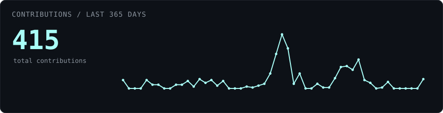
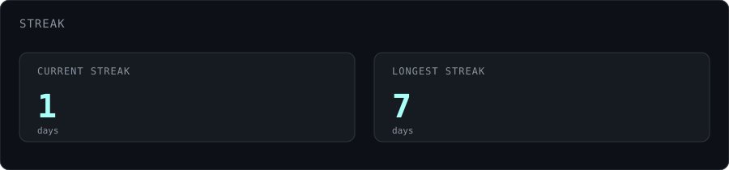
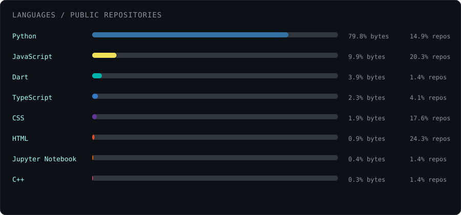
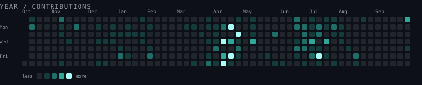

<div align="center">


<br>


</div>

---

## 🚀 About Me

I'm a **Computer Science student and full-stack developer** interested in building practical software and exploring AI/ML systems.

I enjoy working across the stack — from designing interfaces and APIs to databases, algorithms, and machine learning pipelines.

- 🔭 Currently working on **Rubik's Cube Solver**
- 🌱 Currently learning **React, MySQL, Machine Learning, and AI**
- 💻 Building projects with **MERN, Next.js, Python, and ML**
- 👯 Looking to collaborate on **Timetable Optimization**
- 👨‍💻 Check out my projects on **[My Portfolio](https://portfolio-rho-ochre-67.vercel.app/)**
- 📫 Reach me at **mridulbhardwaj13@gmail.com**
- 📄 **[Resume](https://drive.google.com/file/d/1vmQnHmPZaY4rdnVFfRJlj_LICFzyVeFf/view?usp=sharing)**

---

## 🛠️ Tech Stack

<div align="center">


</div>

---

## 🔥 Current Projects & Obsessions

### 🎯 What I'm Building

- 🧩 **Rubik's Cube Solver** — solving the cube using algorithms and search techniques
- 📅 **Timetable Optimization** — applying optimization algorithms to generate better academic schedules
- 🤖 **AI / ML Projects** — learning and implementing machine learning and deep learning systems
- 🧠 **Adaptive AI Tutoring** — exploring learner modeling, knowledge tracing, and LLM-based tutoring

---

## 📊 GitHub Analytics

<div align="center">



<br>



<br>



</div>

---

## 📈 Contribution Activity

<div align="center">



</div>

---

## 🏆 Featured Projects

<div align="center">

<a href="https://github.com/mri-hslr/career-counselling-backend">

</a>

<a href="https://github.com/mri-hslr/timettable_optimization">

</a>

</div>

---

## 🧠 Currently Learning

```text
AI / ML
├── Machine Learning
├── Deep Learning
├── PyTorch
├── TensorFlow
├── Knowledge Tracing
├── LLMs
└── RAG Systems

Software Development
├── MERN Stack
├── Next.js
├── FastAPI
├── PostgreSQL
├── Docker
└── System Design
🌐 Let's Connect
<div align="center">

<a href="https://twitter.com/@mri3231">

</a>

<a href="https://www.leetcode.com/johanliebert77">

</a>

<a href="mailto:mridulbhardwaj13@gmail.com">

</a>

<a href="https://portfolio-rho-ochre-67.vercel.app/">

</a>

</div>

<div align="center">


<em><b>I love connecting with different people</b>, so if you want to say <b>hi, I'll be happy to meet you!</b> 😊</em>
</div>

<div align="center">


</div>
```